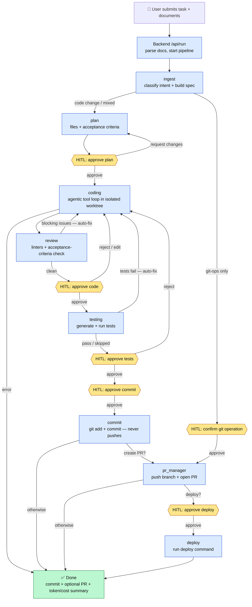

# Project Guide — The Coding Agent, Explained From Scratch

This guide explains, in plain language, what this project is and exactly what happens
from the moment a user submits a request to the moment a code change is committed. No prior
knowledge assumed — terms are defined as we go.

---

## 1. What is this, in one paragraph?

This is a **coding assistant that does real work on a real codebase, but asks a human for
approval at each important step.** You describe a task in plain English ("update the About Us
page"), optionally attach documents (a PRD, a design screenshot), and the system plans the
change, writes the code, reviews it, tests it, and commits it — pausing to let you approve or
correct it along the way. It edits a **separate target repository** (your actual project),
not itself.

Think of it as a junior developer who: reads your instructions, looks at your codebase, makes
a plan, shows you the plan, writes the code, runs the tests, and shows you the result — and
never merges anything without your sign-off.

### Two repositories — don't confuse them
- **The agent** = this project (the "brain": a Python backend + a web UI).
- **The target repo** = the project being edited, set by the `LOCAL_REPO_PATH` setting.

Everything the agent "writes" happens in the target repo, never in itself.

---

## 2. The technology, in plain terms

- **LLM (Large Language Model)** — the AI (OpenAI's GPT models) that reads and writes text/code.
- **Backend** — a Python web server ([FastAPI](main.py)) that runs the whole process.
- **Frontend** — a website ([React](frontend/)) where you type the task and click Approve/Reject.
- **LangGraph** — a library that runs the work as a **pipeline** of steps (a "state machine"),
  and can **pause** a step to wait for a human, then **resume** later. This is the backbone.
- **WebSocket** — a live connection between the browser and server so you see progress in
  real time (like a live chat feed of what the AI is doing).

---

## 3. The whole journey at a glance

```
You type a task ─▶ Backend receives it ─▶ Pipeline starts:

  ingest  ─▶  plan  ─▶ [YOU APPROVE] ─▶ coding ─▶ review ─▶ [YOU APPROVE]
 (understand)  (design)                (write it) (check it)
                                                                  │
                        [YOU APPROVE] ◀─ testing ◀────────────────┘
                             │          (write + run tests)
                             ▼
                        commit  ─▶ (optional) open a Pull Request ─▶ (optional) deploy
                     (save it, no push)
```

Each `[YOU APPROVE]` is a **checkpoint** where the pipeline stops and waits for you.

### The detailed flow (rendered diagram)

Hexagons are **human approval gates**. Arrows that loop *back to `coding`* are the
**automatic self-correction** (reflect) loops — the agent fixing blocking review comments or
failing tests on its own before asking you.



Now let's walk through each step slowly.

---

## 4. Step by step: from your query to the final output

### Step 0 — You submit the task (the web form)
On the intake page you provide:
- **Instructions** — plain English, e.g. *"Create a new branch from main and add 'auto-generated
  by agent' to the bottom of the About Us page."*
- **Attachments** (optional) — a PRD/BRD as PDF or Word, a Figma screenshot, etc.
- **Toggles** — "Open a Pull Request?" and "Deploy?" (both off by default).

You click submit. The browser sends all of this to the backend's `/api/run` endpoint, along
with your login token.

### Step 1 — The backend accepts and dispatches
[`main.py`](main.py) does four quick things:
1. Checks you're logged in (a security token).
2. Creates a unique `task_id` for this run.
3. **Reads your attachments into text** (see §5 below) — PDFs, Word docs, and images are all
   converted to plain text so the AI can understand them.
4. Starts the pipeline **in the background** and immediately returns the `task_id`.

**Why in the background?** A full run takes minutes and pauses for your approval. A normal web
request can't wait that long. So the request just *starts* the job; progress comes over a
separate live connection.

### Step 2 — The browser opens a live feed
The frontend connects to a **WebSocket** (`/ws/{task_id}?token=...`). From now on, every little
update ("Reading files…", "Running tests…", "12,300 tokens · $0.04") streams to your screen
live. The connection requires your token, because this feed carries your code and spec — it
must not be public.

### Step 3 — `ingest`: understand what you actually want
The first pipeline step ([`agents/ingest.py`](agents/ingest.py)) does two jobs:

**(a) Figure out the intent.** It asks the LLM to classify your request:
- `code_change` — you want code written/modified.
- `git_ops` — you only want a git action (e.g. "push the current branch and open a PR"), *no*
  code change.
- `mixed` — both.

It also extracts hidden instructions from your words: should it open a PR? deploy? create a new
branch or use the current one? what branch to target? **These natural-language instructions
override the UI toggles** — if you *say* "open a PR," it opens one even if the checkbox was off.

> **Why this matters:** early on, a request like "push the branch and open a PR" was mistakenly
> turned into *generated code* (a script committed to the repo). Classifying intent first means
> words that describe an *action* trigger that action, not code.

**(b) Build a clear specification.** For code changes, it combines your instructions + the text
from your attachments + your repo's conventions (see §5) into one clean **spec** — a well-organized
description of the goal, scope, requirements, and any open questions.

If the request was pure `git_ops`, it skips all the coding steps and jumps straight to a
confirmation gate, then to the git action.

### Step 4 — `plan`: design the change (and define "done")
[`agents/planning.py`](agents/planning.py) asks the LLM to produce a **structured plan**, not
loose prose. The plan is a JSON object with:
- `summary` and `approach`
- `files_to_touch` (which files, and why)
- **`acceptance_criteria`** — specific, testable pass/fail conditions, e.g. *"The text
  'auto-generated by agent' appears at the end of the About Us page."*
- `test_strategy` and `risks`

> **Why acceptance criteria are the key idea:** they become a **contract**. Later, the code is
> *written to satisfy them*, and the reviewer *checks them one by one*. Without them, "is this
> correct?" is a vague opinion; with them, it's a checklist.

### Step 5 — HITL checkpoint #1: approve the plan
The pipeline **pauses** and shows you the plan and its acceptance criteria. You can **Approve**,
or **Request changes** (type feedback; it re-plans). Nothing has been coded yet — this is the
cheapest place to steer. (How pausing works technically is in §7.)

### Step 6 — `coding`: actually write the code
This is the heart of the system ([`agents/coding.py`](agents/coding.py)). Three important ideas:

**(a) It works in an isolated copy (a "git worktree").** Before writing anything, it creates a
throwaway working copy of the target repo on a new branch. All edits happen there.
> **Why:** two runs at once can't clobber each other, and if a run fails, we just delete the
> copy — the real checkout was never touched. Any commit still survives on its branch.

**(b) It uses tools in a loop, like a real developer.** Instead of asking the AI to spit out
all files in one shot, we give it a set of **tools** and let it work step by step:
- `list_files`, `grep`, `read_file` — explore the codebase.
- `create_file`, `apply_patch` — make changes.
- `run_command` — run tests/linters to check its own work.
- `finish` — declare it's done.

The AI loops: look around → make a small edit → run a test → read the error → fix → … until it
calls `finish` or hits a safety limit.
> **Why a loop instead of one big answer:** real code changes need *looking* — grep for a
> function, read the actual file, run the test, react to the traceback. A single blind "here's
> all the code" answer doesn't scale to real repos.

**(c) Edits are small patches, not whole-file rewrites.** `apply_patch` finds an exact snippet
and replaces it — and it *refuses* if the snippet isn't found or appears more than once.
> **Why:** rewriting a whole file risks the AI silently truncating a large file and corrupting
> it. Small, exact patches can't do that.

Commands run inside a **sandbox** (a locked-down Docker container with no network when
available, otherwise a restricted "allow-list" of safe commands). So the AI can run tests but
can't harm your machine.

### Step 7 — `review`: check the code
[`agents/review.py`](agents/review.py) runs two kinds of review:
1. **Linters** (`ruff` for Python, `eslint` for JS/TS) — automated style/error checks.
2. **An LLM review** that is *handed the acceptance criteria* and told: mark any criterion the
   code does **not** satisfy as a **"blocking"** comment.

### Step 8 — The "reflect loop" (self-correction)
Here's the clever part. After review:
- If there are **blocking** problems (and we haven't hit the retry limit), the pipeline
  **automatically loops back to coding** to fix them — *before* bothering you.
- Same after testing: if tests genuinely **fail**, it loops back to coding with the failure
  output and tries again.

> **Why:** the AI should fix objective, checkable problems (failing tests, unmet criteria) on
> its own. You should only be asked to look at code that has already converged. The number of
> auto-retries is capped so it can't loop forever — if it can't converge, it escalates to you.

### Step 9 — HITL checkpoint #2: approve the code
You see the **diff** (before/after) and the review comments. You can **Approve**, **Reject with
feedback** (loops back to coding), or **Edit** the code directly.

### Step 10 — `testing`: write and run tests
[`agents/testing.py`](agents/testing.py) asks the LLM to write unit tests for the change, then
**detects the right test runner by language** (pytest for Python; vitest/jest/npm-test for
JS/TS) and runs them in the sandbox.
> **Why language detection:** an early bug ran `pytest` on a Next.js repo, found zero Python
> tests, and reported a false failure. Now the runner matches the code's language, and
> "no tests / no runner" is treated as *skipped*, not *failed*.

### Step 11 — HITL checkpoint #3: approve the test results
You see whether tests passed. Approve to continue, reject to loop back, or abort.

### Step 12 — HITL checkpoint #4: approve the commit
A final gate before saving anything.

### Step 13 — `commit`: save the change (but do NOT push)
[`agents/commit.py`](agents/commit.py) runs `git add` + `git commit` **in the worktree only. It
never pushes to a remote.**
> **Why commit-only by default:** committing is safe and local. Pushing to GitHub is an
> outward-facing action — it should be a separate, deliberate choice, not automatic.

### Step 14 — Optional: Pull Request and Deploy
Only if you asked for them (via toggle or your instructions):
- `pr_manager` — pushes the branch and opens a GitHub Pull Request (targeting the branch you
  named, with a safety check that it isn't a PR into itself).
- `deploy` — runs your configured deploy command, behind one more approval gate.

### Step 15 — The final output
When the run ends, you get: a **commit** on a new branch in your target repo (and optionally a
**PR link**), a summary of what changed, the test results, and the total **tokens and cost** the
run used. If anything failed, the isolated worktree is discarded so your repo stays clean.

---

## 5. How the agent "reads" documents and your codebase

This is the part people ask about most: chunking, retrieval, and why.

### 5a. Your attachments (PRD/BRD/screenshots) — parsed, not chunked
When you attach files, [`tools/doc_ingest.py`](tools/doc_ingest.py) converts each to plain text:
- **PDF** → text via `pypdf`
- **Word (.docx)** → text via `python-docx`
- **Images / Figma screenshots** → a description written by a **vision-capable LLM**
- **Text/Markdown/code** → read as-is

This text is then **inlined directly** into the spec-building prompt.
> **Why not embed these into a database?** They're **specific to one run** and thrown away
> after. Putting them into a shared, permanent vector database would pollute it across
> unrelated tasks and require cleanup. Inlining keeps them scoped to your single request.
> The trade-off: a *very* large PRD can crowd the prompt — fine for a few pages, not ideal for
> 60. (An optional per-run vector index for huge attachments is a possible future add-on.)

### 5b. Your codebase conventions — read from `AGENTS.md` / `CLAUDE.md`
To follow *your* project's style, the agent needs to know its conventions. The **primary**
source ([`arch_rag/retriever.py`](arch_rag/retriever.py)) is the **target repo's own guidance
files**: `AGENTS.md` or `CLAUDE.md` (in the repo root *or* under `.claude/`). These are read
whole (capped at ~12,000 characters) and inlined into the prompts.

> **Why this strategy?** These files are:
> - **Co-located with the code** and maintained by the repo's owners, so they're **always
>   current** — no separate copy to keep in sync.
> - **Small** — a few pages. There's no need for a database or "smart search"; just read them.
> - This is exactly how professional coding agents (Codex, Claude Code) source conventions.
>
> Plus, the coding step already **reads the real code directly** (grep/read_file), which is the
> most accurate source of "how this project does things." Documentation is a secondary hint.

### 5c. The fallback: RAG with chunking (for a large external doc corpus)
If the target repo has *no* guidance files, the agent falls back to **RAG** (Retrieval-Augmented
Generation) over a folder of architecture docs (`arch_docs/*.md`). This is the part that uses
chunking. Here's how and why:

**What is RAG?** When you have *more* documentation than fits in a single prompt, you can't send
it all. Instead you: (1) split the docs into small pieces, (2) turn each piece into a list of
numbers ("embedding") that captures its meaning, (3) store those in a **vector database**, and
(4) at query time, find the few pieces most similar in meaning to the current task and send
only those.

**Chunking** — [`arch_rag/ingest.py`](arch_rag/ingest.py) uses a **`MarkdownTextSplitter` with
`chunk_size=800` characters and `chunk_overlap=100`**:
- **Why chunk at all?** So retrieval is *precise* — you fetch the one relevant paragraph, not a
  whole 20-page document.
- **Why ~800 characters?** Small enough that each chunk is about one focused idea (so a match is
  meaningful), big enough to keep enough context to be useful. Too small = fragmented,
  meaningless snippets; too big = imprecise matches that drag in irrelevant text.
- **Why 100 characters of overlap?** So an idea that straddles a chunk boundary (a sentence
  split across two chunks) isn't lost — the overlap ensures it appears intact in at least one
  chunk.
- **Why a *Markdown* splitter specifically?** It splits along the document's natural structure
  (headings, sections) instead of cutting mid-sentence, so each chunk is coherent.

**Embedding + storage** — each chunk is embedded with OpenAI's embeddings model and stored in a
**Chroma** vector database (`./chroma_db`) on disk. This is a one-time step
(`ingest_arch_docs()`).

**Retrieval** — at query time, `get_arch_context(query)` embeds the query and does a
**similarity search returning the top `k=5` chunks**.
- **Why top-5?** Enough to cover the relevant context without flooding the prompt with
  marginally-related text (which both costs tokens and distracts the model).
- The similarity is standard **vector distance** — chunks whose meaning is closest to the task.

> **The honest summary:** for this agent, chunking/RAG is a **fallback, not the main path.** The
> main path is "read the repo's own `AGENTS.md`/`CLAUDE.md` and read the real code," which is
> simpler, always current, and needs no database. RAG earns its place only when there's a
> genuinely large external corpus of standards/architecture docs.

---

## 6. System prompts — how each step "instructs" the AI

A **system prompt** is the standing instruction that tells the LLM who it is and how to behave
for a step. Each agent builds its own. In simple terms:

- **Ingest (intent):** *"Classify this developer request as code_change / git_ops / mixed, and
  extract whether they want a PR, a deploy, a new branch, and which target branch. Return JSON."*
- **Ingest (spec):** *"You are a senior product engineer. Turn these inputs into one clear,
  self-contained specification covering goal, scope, requirements, UI/UX notes, constraints, and
  open questions."*
- **Plan:** *"You are a senior engineer planning a change. Return ONLY JSON with summary,
  approach, files_to_touch, and specific testable acceptance_criteria, test_strategy, risks."*
- **Coding (the richest):** *"You are a senior engineer working directly in an existing repo.
  Explore with your tools first — don't guess file contents. Edit with apply_patch. Match the
  existing style. Satisfy every ACCEPTANCE CRITERION (a reviewer will check them). Run tests
  with run_command before you finish."* On a retry, it also injects the exact **feedback to
  address** (blocking review comments, or the test failure output).
- **Review:** *"Review these changes. Check each acceptance criterion — mark any unmet one as
  'blocking'. Also flag logic errors, security issues, missing error handling. Return JSON
  comments."*
- **Testing:** *"Write meaningful unit tests for this change, matching the project's existing
  test framework and style."*

> **Why prompts are built fresh each step with only the relevant context (the repo's guidance,
> the spec, the plan, the current feedback):** an LLM does better with a focused, role-specific
> instruction than one giant do-everything prompt. Each step is an expert at one job.

---

## 7. Human-in-the-loop (HITL) — how pausing actually works

**HITL** means the machine does the work but a human approves the important decisions. There are
gates for: the git-ops confirmation, the plan, the code, the tests, the commit, and deploy.

**How a pause works technically** ([`hitl/checkpoints.py`](hitl/checkpoints.py)):
1. At a gate, the pipeline calls LangGraph's `interrupt(...)` with a payload (the plan, the diff,
   the test results — whatever you need to decide).
2. LangGraph **freezes the entire run and saves its full state** to a database (see §8), then
   returns control. The backend sends you a `hitl_required` message; the UI shows the gate.
3. You click **Approve / Reject / Edit / Abort** (optionally with typed feedback).
4. The frontend calls `/api/resume/{task_id}`; the backend calls `Command(resume={action,
   feedback})`. LangGraph **reloads the saved state and continues** exactly where it left off.

**What the decisions mean:**
- **Approve** → proceed to the next step.
- **Reject (with feedback)** → loop back (e.g. re-plan, or re-code addressing your notes).
- **Edit** → you hand-edit the generated code, and it uses your version.
- **Override** → proceed despite warnings.
- **Abort** → stop the run; the isolated worktree is discarded.

> **Why HITL is the core design choice:** this agent is meant for real codebases where a wrong
> change is expensive. Full autonomy is risky; pure manual is slow. HITL keeps the human in
> control of *decisions* while the machine does the *labor* — and the automatic reflect loop
> (§8 of the pipeline) means humans are only asked about judgment calls, not mechanical fixes.

---

## 8. The safety nets (why you can trust it)

- **Durable memory (checkpointing).** Every step's state is saved to a SQLite database
  ([`graph.py`](graph.py)). If the server restarts while a run is paused waiting for you, the run
  **survives** and can still be resumed. *Why:* a run might wait hours at a gate; a crash
  shouldn't lose it.
- **Isolation.** Per-run git worktrees + a sandboxed command runner mean a run can't corrupt
  your machine or the main checkout. *Why:* the AI is writing files and running commands from
  its own (imperfect) output.
- **Resilience.** Every AI call has a timeout and automatic retries with backoff. *Why:* one
  temporary network hiccup shouldn't kill a 5-minute run.
- **Cost control.** Every AI call's tokens and cost are tracked live, with an optional per-run
  **budget cap** that stops the coding loop if exceeded. *Why:* real money flows through the
  LLM; you need visibility and a kill-switch.
- **Security.** Login required on both the API and the live feed; passwords checked in constant
  time; and **path-traversal guards** ensure the AI's file writes stay inside the target repo
  (a filename like `../../etc/x` is rejected). *Why:* file paths come from AI output and must
  never escape the intended folder.

---

## 9. The two ideas behind every design choice

If you remember nothing else:

1. **Isolation** — the agent edits a *separate* repo, in a *throwaway worktree*, running
   commands in a *sandbox*. Nothing it does can damage the host or your main branch.
2. **A closed verify loop with a human on top** — a structured plan sets acceptance criteria →
   coding builds to them → review and tests measure against them → failures loop back
   automatically → and a human approves the judgment calls. Machines handle the mechanical
   correctness; humans handle the decisions.

---

## 10. Where to look in the code

| You want to understand… | Look at |
| --- | --- |
| The pipeline shape + routing | [`graph.py`](graph.py) |
| Request handling, live feed, resume | [`main.py`](main.py) |
| Understanding the request | [`agents/ingest.py`](agents/ingest.py) |
| The structured plan | [`agents/planning.py`](agents/planning.py) |
| The agentic coding loop | [`agents/coding.py`](agents/coding.py), [`tools/agent_tools.py`](tools/agent_tools.py) |
| Patch editing / safe file ops / worktrees | [`tools/patch.py`](tools/patch.py), [`tools/local_repo.py`](tools/local_repo.py) |
| The command sandbox | [`tools/sandbox.py`](tools/sandbox.py) |
| Review, testing | [`agents/review.py`](agents/review.py), [`agents/testing.py`](agents/testing.py) |
| Human approval gates | [`hitl/checkpoints.py`](hitl/checkpoints.py) |
| Conventions / RAG | [`arch_rag/`](arch_rag/) |
| Cost tracking | [`usage.py`](usage.py) |

For the deeper engineering reference, see [AGENTS.md](AGENTS.md).
